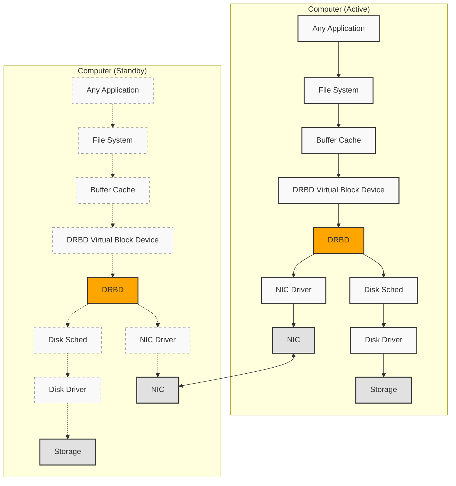

# Diagrama de arquitectura DRBD

## Descripción

Este diagrama muestra la arquitectura DRBD (Distributed Replicated Block Device) con dos nodos:

- **Nodo Activo (izquierda)**: Maneja activamente las aplicaciones y el almacenamiento
- **Nodo Standby (derecha)**: Mantiene una réplica sincronizada pero no está activo

### Componentes principales:

1. **Any Application**: Aplicaciones que utilizan el almacenamiento
2. **File System**: Sistema de archivos
3. **Buffer Cache**: Caché de búfer del sistema
4. **DRBD Virtual Block Device**: Dispositivo de bloque virtual de DRBD
5. **DRBD**: Núcleo de replicación distribuida
6. **Disk Sched**: Planificador de disco
7. **Disk Driver**: Controlador de disco
8. **NIC Driver**: Controlador de interfaz de red
9. **Storage**: Almacenamiento físico
10. **NIC**: Interfaz de red

### Flujo de datos:

- **Líneas sólidas**: Rutas de datos activas
- **Líneas punteadas**: Rutas de datos inactivas (nodo standby)
- **TCP/IP o RDMA**: Protocolo de comunicación entre nodos DRBD

La replicación se realiza a nivel de bloque, sincronizando automáticamente los datos entre ambos nodos para garantizar alta disponibilidad.
