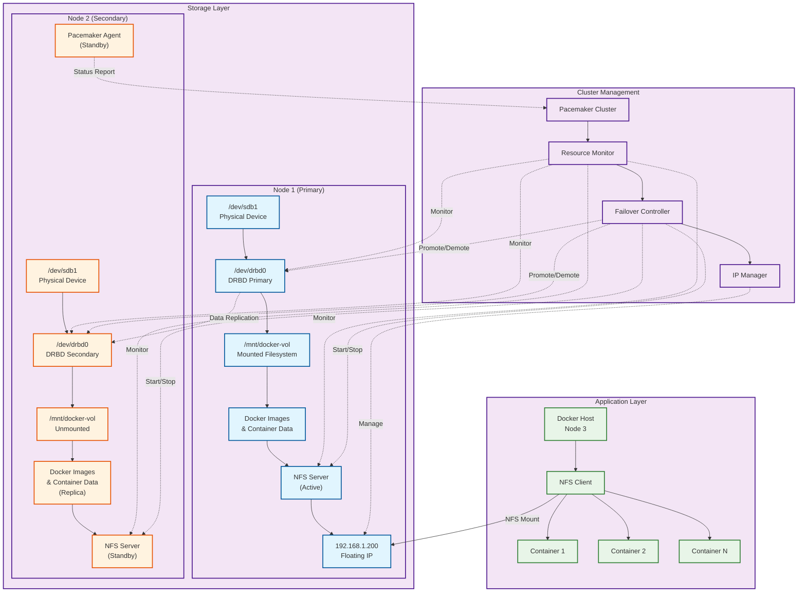

# DRBD High Availability Storage for Docker

[](LICENSE)
[](https://linbit.com/drbd/)
[](https://clusterlabs.org/)
[](https://docker.com/)
[](https://en.wikipedia.org/wiki/Network_File_System)
[](https://www.linux.org/)
[](#)
[](#)
[](#)

## Descripción

Diseño de arquitectura y laboratorio de pruebas para implementar una solución de alta disponibilidad para almacenamiento de contenedores Docker utilizando DRBD (Distributed Replicated Block Device) con gestión de clúster Pacemaker y servicios NFS. Este repositorio contiene las instrucciones detalladas y configuraciones necesarias para crear un entorno de laboratorio que demuestre esta arquitectura de alta disponibilidad.

## Características principales

- ✅ **Alta disponibilidad** - Failover automático con tiempo de inactividad mínimo
- ✅ **Consistencia de datos** - Replicación síncrona garantiza integridad
- ✅ **Failover transparente** - Las aplicaciones continúan ejecutándose durante el failover
- ✅ **Almacenamiento centralizado** - Punto único de gestión de almacenamiento para contenedores
- ✅ **Escalabilidad** - Fácil adición de nuevos hosts Docker como clientes NFS

## Arquitectura del sistema



## Componentes del sistema

### Node 1: Nodo DRBD primario
- **Dispositivo físico**: `/dev/sdb1` - Dispositivo de bloque raw
- **Dispositivo DRBD**: `/dev/drbd0` - Dispositivo de bloque replicado
- **Punto de montaje**: `/mnt/docker-vol` - Montaje del sistema de archivos
- **Servidor NFS**: Servicio NFS activo
- **IP flotante**: `192.168.1.200` - IP virtual para alta disponibilidad

### Node 2: Nodo DRBD secundario
- **Dispositivo físico**: `/dev/sdb1` - Dispositivo de bloque raw (standby)
- **Dispositivo DRBD**: `/dev/drbd0` - Dispositivo de bloque replicado (secundario)
- **Punto de montaje**: `/mnt/docker-vol` - Montaje del sistema de archivos (standby)
- **Servidor NFS**: Servicio NFS en standby
- **Pacemaker**: Modo standby, listo para failover

### Node 3: Host Docker
- **Cliente NFS**: Se conecta al servicio NFS vía IP flotante
- **Almacenamiento de contenedores**: Imágenes y contenedores almacenados en NFS; el servidor Docker es únicamente para ejecución

## Requisitos del sistema

### Requisitos de hardware
- **Nodos DRBD**: Mínimo 2 nodos con almacenamiento local
- **Red dedicada**: Conexión de red de baja latencia entre nodos DRBD
- **Host Docker**: Servidor con Docker Engine instalado

### Requisitos de software
- **Sistema operativo**: Linux (RHEL/CentOS 8+, Ubuntu 20.04+, SLES 15+)
- **DRBD**: Versión 9.x o superior
- **Pacemaker**: Versión 2.x o superior
- **Corosync**: Para comunicación del clúster
- **NFS Utils**: Para servicios NFS
- **Docker**: Versión 20.x o superior

## Instalación y configuración

### 1. Preparación de los nodos DRBD

```bash
# Instalar DRBD y Pacemaker en ambos nodos
yum install -y drbd90-kmp-default drbd90-utils pacemaker corosync nfs-utils

# Configurar dispositivo DRBD
cat > /etc/drbd.d/docker-vol.res << EOF
resource docker-vol {
    protocol C;
    device /dev/drbd0;
    disk /dev/sdb1;
    meta-disk internal;
    
    on node1 {
        address 192.168.1.10:7789;
    }
    
    on node2 {
        address 192.168.1.11:7789;
    }
}
EOF

# Crear metadata y inicializar DRBD
drbdadm create-md docker-vol
systemctl enable drbd
systemctl start drbd

# En el nodo primario solamente
drbdadm primary docker-vol --force
mkfs.ext4 /dev/drbd0
```

### 2. Configuración de Pacemaker

```bash
# Configurar Pacemaker en ambos nodos
pcs host auth node1 node2
pcs cluster setup docker-cluster node1 node2
pcs cluster start --all
pcs cluster enable --all

# Configurar recursos del clúster
pcs resource create drbd_resource ocf:linbit:drbd \
    drbd_resource=docker-vol \
    op monitor interval=60s
    
pcs resource create drbd_fs Filesystem \
    device="/dev/drbd0" \
    directory="/mnt/docker-vol" \
    fstype="ext4"
    
pcs resource create nfs_server nfsserver \
    nfs_shared_infodir="/mnt/docker-vol/nfsinfo" \
    nfs_ip="192.168.1.200"
    
pcs resource create virtual_ip IPaddr2 \
    ip="192.168.1.200" \
    cidr_netmask="24"

# Configurar dependencias
pcs constraint colocation add drbd_fs with drbd_resource INFINITY with-rsc-role=Master
pcs constraint order drbd_resource then drbd_fs
pcs constraint colocation add nfs_server with virtual_ip INFINITY
pcs constraint order virtual_ip then nfs_server
```

### 3. Configuración del host Docker

```bash
# Instalar Docker
curl -fsSL https://get.docker.com | sh
systemctl enable docker

# Configurar Docker para usar NFS
mkdir -p /mnt/nfs-docker
echo "192.168.1.200:/mnt/docker-vol /mnt/nfs-docker nfs defaults,_netdev 0 0" >> /etc/fstab
mount -a

# Configurar Docker daemon
cat > /etc/docker/daemon.json << EOF
{
    "data-root": "/mnt/nfs-docker/docker",
    "storage-driver": "overlay2"
}
EOF

# Reiniciar Docker
systemctl restart docker
```

## Proceso de failover

1. **Detección de falla**: Pacemaker detecta la falla del nodo primario
2. **Promoción de recursos**: El dispositivo DRBD secundario se promueve a primario
3. **Montaje del sistema de archivos**: Monta el sistema de archivos en el nuevo nodo primario
4. **Inicio de servicios**: Inicia el servidor NFS en el nuevo nodo primario
5. **Migración de IP**: Mueve la IP flotante al nuevo nodo primario
6. **Reconexión del cliente**: El host Docker se reconecta al nuevo servidor NFS

## Monitoreo y mantenimiento

### Comandos útiles para monitoreo

```bash
# Estado del clúster DRBD
drbdadm status docker-vol

# Estado del clúster Pacemaker
pcs status

# Verificar montajes NFS
showmount -e 192.168.1.200

# Estado de Docker
docker info
docker system df
```

### Procedimientos de mantenimiento

```bash
# Modo mantenimiento del clúster
pcs cluster standby node1

# Sincronización manual DRBD
drbdadm invalidate docker-vol

# Backup de configuración
pcs config backup cluster-backup.tar.bz2
```

## Resolución de problemas

### Problemas comunes

1. **Split-brain de DRBD**: Verificar conectividad de red y resolver manualmente
2. **Falla de montaje NFS**: Verificar permisos y exportaciones NFS
3. **Recursos atorados en Pacemaker**: Limpiar recursos con `pcs resource cleanup`

### Logs importantes

```bash
# Logs de DRBD
journalctl -u drbd

# Logs de Pacemaker
journalctl -u pacemaker

# Logs de Docker
journalctl -u docker
```

## Consideraciones de seguridad

- Configurar iptables/firewalld para permitir tráfico del clúster
- Usar autenticación SSH con claves para acceso a nodos
- Implementar monitoreo de red para detectar intrusiones
- Configurar backups regulares del almacenamiento DRBD

## Contribuciones

Las contribuciones son bienvenidas. Por favor:

1. Fork el repositorio
2. Crea una rama para tu feature (`git checkout -b feature/nueva-funcionalidad`)
3. Commit tus cambios (`git commit -am 'Añadir nueva funcionalidad'`)
4. Push a la rama (`git push origin feature/nueva-funcionalidad`)
5. Crea un Pull Request

## Licencia

Este proyecto está licenciado bajo MIT License. Ver el archivo [LICENSE](LICENSE) para detalles.

## Autor

Diseño de arquitectura por Rodrigo Ernesto Álvarez Aguilera (@incogniadev) - Ingeniero DevOps en Promad Business Solutions

---

*Esta arquitectura proporciona una base robusta para cargas de trabajo containerizadas que requieren almacenamiento persistente y altamente disponible.*
