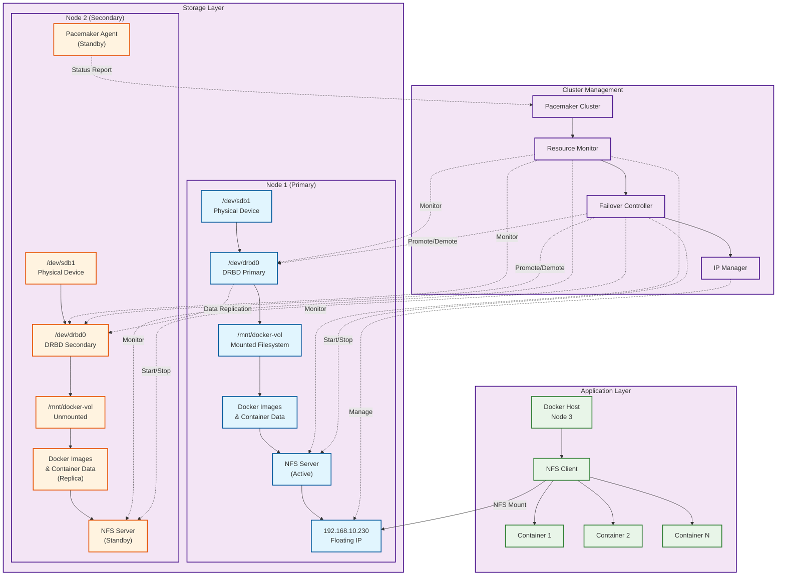

# DRBD High Availability Architecture

## Overview

This document describes a high availability storage solution using DRBD (Distributed Replicated Block Device) with Pacemaker cluster management and NFS services for containerized workloads.

## System Architecture

## Architecture Components

### Node 1: Primary DRBD Node
- **Physical Device**: `/dev/sdb1` - Raw block device
- **DRBD Device**: `/dev/drbd0` - Replicated block device
- **Mount Point**: `/mnt/docker-vol` - File system mount
- **NFS Server**: Active NFS service
- **Floating IP**: `192.168.10.230` - Virtual IP for high availability

### Node 2: Secondary DRBD Node
- **Physical Device**: `/dev/sdb1` - Raw block device (standby)
- **DRBD Device**: `/dev/drbd0` - Replicated block device (secondary)
- **Mount Point**: `/mnt/docker-vol` - File system mount (standby)
- **NFS Server**: Standby NFS service
- **Pacemaker**: Standby mode, ready for failover

### Pacemaker Cluster Manager
- **DRBD Monitoring**: Continuously monitors DRBD resource status
- **Node Promotion**: Promotes secondary node to primary during failover
- **IP Management**: Manages floating IP assignment
- **NFS Management**: Controls active NFS service

### Node 3: Docker Host
- **NFS Client**: Connects to NFS service via floating IP
- **Container Storage**: Images and containers stored on NFS
- **Network Configuration**:
  - **Primary IP**: `10.0.0.233/8` - Management network
  - **Secondary IP**: `192.168.10.233/24` - Cluster network
  - **NFS Access**: Connects to floating IP `192.168.10.230/24`

## Key Design Principles

### Docker Storage Architecture
**ALL Docker images and containers MUST be stored on the NFS-mounted storage provided by the DRBD cluster.**

#### Storage Components
- **Docker Images**: Stored in `/mnt/docker-vol/docker/images/` on NFS
- **Container Data**: All container volumes and persistent data on NFS
- **Docker Daemon**: Configured to use NFS-mounted directories for:
  - Image storage
  - Container runtime data
  - Volume mounts
  - Build cache

#### Docker Host Role
- **Execution Only**: The Docker server (Node 3) serves purely as an execution engine
- **No Local Storage**: No images or persistent data stored locally
- **NFS Dependency**: Complete dependency on NFS for all Docker operations
- **Stateless Operation**: Can be replaced or rebuilt without data loss

## Failover Process

1. **Failure Detection**: Pacemaker detects primary node failure
2. **Resource Promotion**: Secondary DRBD device promoted to primary
3. **Filesystem Mount**: Mount filesystem on new primary node
4. **Service Start**: Start NFS server on new primary node
5. **IP Migration**: Move floating IP to new primary node
6. **Client Reconnection**: Docker host reconnects to new NFS server

## Benefits

### High Availability Features
- ✅ **Automatic failover** - Minimal downtime during node failures
- ✅ **Data consistency** - Synchronous replication ensures integrity
- ✅ **Transparent failover** - Applications continue during failover
- ✅ **Centralized storage** - Single storage management point
- ✅ **Scalability** - Easy addition of Docker execution hosts

### NFS-Centralized Storage Benefits
1. **High Availability**: Images and containers survive Docker host failures
2. **Consistency**: Same images available across multiple Docker hosts
3. **Backup Simplicity**: Single storage location for all Docker data
4. **Scalability**: Easy to add more Docker execution hosts
5. **Disaster Recovery**: Complete Docker environment restoration from DRBD replica

## Network Configuration

### IP Address Scheme
- **Node 1 (DRBD Primary)**:
  - Management: `10.0.0.231/8`
  - Cluster: `192.168.10.231/24`
- **Node 2 (DRBD Secondary)**:
  - Management: `10.0.0.232/8`
  - Cluster: `192.168.10.232/24`
- **Node 3 (Docker Host)**:
  - Management: `10.0.0.233/8`
  - Cluster: `192.168.10.233/24`
- **Floating IP**: `192.168.10.230/24` (Virtual IP for HA)

### Network Requirements
- **Low Latency**: <1ms ideally between DRBD nodes
- **Dedicated Network**: Separate network for cluster communication
- **Bandwidth**: Sufficient for Docker image transfers and container data

## Security Considerations

- Configure iptables/firewalld for cluster traffic
- Use SSH key authentication for node access
- Implement network monitoring for intrusion detection
- Regular backup configuration of DRBD storage
- Secure NFS exports with proper access controls

---

*This architecture provides a robust foundation for containerized workloads requiring persistent, highly available storage.*
