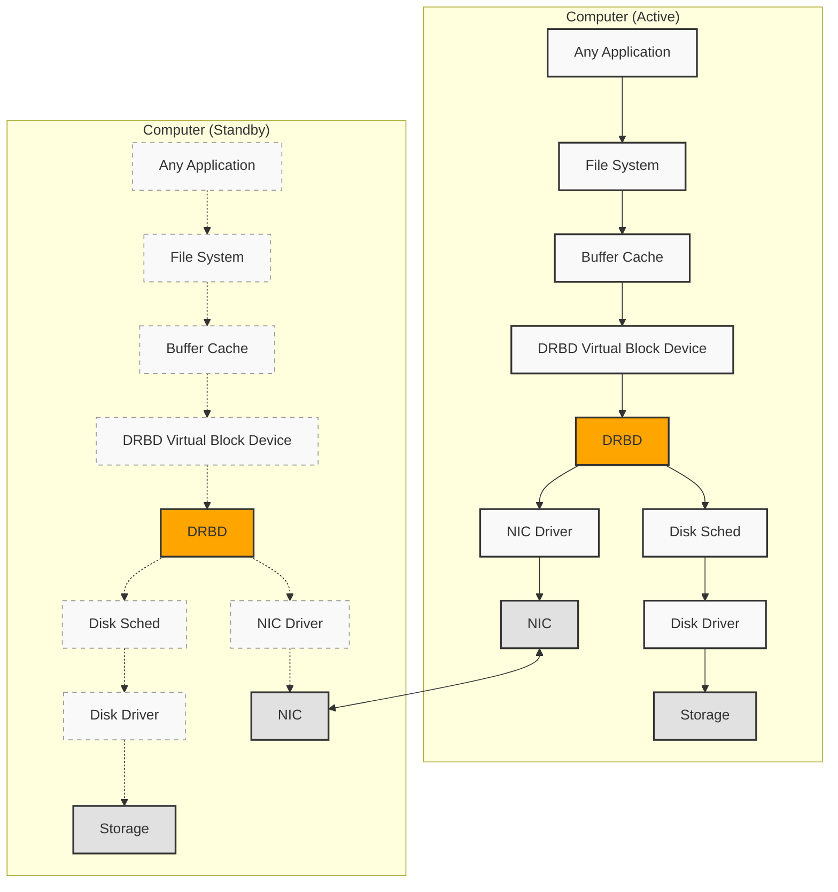

# Arquitectura de alta disponibilidad DRBD

## Descripción general

Este documento describe una solución de almacenamiento de alta disponibilidad utilizando DRBD (Distributed Replicated Block Device) con gestión de clúster Pacemaker y servicios NFS para cargas de trabajo en contenedores.

## Arquitectura del sistema

## Componentes de la arquitectura

### Nodo 1: Nodo DRBD primario
- **Dispositivo físico**: `/dev/sdb1` - Dispositivo de bloque raw
- **Dispositivo DRBD**: `/dev/drbd0` - Dispositivo de bloque replicado
- **Punto de montaje**: `/mnt/docker-vol` - Montaje del sistema de archivos
- **Servidor NFS**: Servicio NFS activo
- **IP flotante**: `192.168.10.230` - IP virtual para alta disponibilidad

### Nodo 2: Nodo DRBD secundario
- **Dispositivo físico**: `/dev/sdb1` - Dispositivo de bloque raw (en espera)
- **Dispositivo DRBD**: `/dev/drbd0` - Dispositivo de bloque replicado (secundario)
- **Punto de montaje**: `/mnt/docker-vol` - Montaje del sistema de archivos (en espera)
- **Servidor NFS**: Servicio NFS en espera
- **Pacemaker**: Modo en espera, listo para failover

### Gestor de clúster Pacemaker
- **Monitoreo DRBD**: Monitorea continuamente el estado de los recursos DRBD
- **Promoción de nodos**: Promueve el nodo secundario a primario durante el failover
- **Gestión de IP**: Administra la asignación de IP flotante
- **Gestión NFS**: Controla el servicio NFS activo

### Nodo 3: Host Docker
- **Cliente NFS**: Se conecta al servicio NFS vía IP flotante
- **Almacenamiento de contenedores**: Imágenes y contenedores almacenados en NFS
- **Configuración de red**:
  - **IP primaria**: `10.0.0.233/8` - Red de administración
  - **IP secundaria**: `192.168.10.233/24` - Red del clúster
  - **Acceso NFS**: Se conecta a la IP flotante `192.168.10.230/24`

## Principios clave de diseño

### Arquitectura de almacenamiento Docker
**TODAS las imágenes y contenedores Docker DEBEN almacenarse en el almacenamiento montado por NFS proporcionado por el clúster DRBD.**

#### Componentes de almacenamiento
- **Imágenes Docker**: Almacenadas en `/mnt/docker-vol/docker/images/` en NFS
- **Datos de contenedores**: Todos los volúmenes de contenedores y datos persistentes en NFS
- **Daemon Docker**: Configurado para usar directorios montados en NFS para:
  - Almacenamiento de imágenes
  - Datos de tiempo de ejecución de contenedores
  - Montajes de volúmenes
  - Caché de construcción

#### Rol del host Docker
- **Solo ejecución**: El servidor Docker (Nodo 3) sirve únicamente como motor de ejecución
- **Sin almacenamiento local**: No hay imágenes o datos persistentes almacenados localmente
- **Dependencia de NFS**: Dependencia completa de NFS para todas las operaciones Docker
- **Operación sin estado**: Puede ser reemplazado o reconstruido sin pérdida de datos

## Proceso de failover

1. **Detección de falla**: Pacemaker detecta la falla del nodo primario
2. **Promoción de recursos**: El dispositivo DRBD secundario se promueve a primario
3. **Montaje del sistema de archivos**: Monta el sistema de archivos en el nuevo nodo primario
4. **Inicio de servicios**: Inicia el servidor NFS en el nuevo nodo primario
5. **Migración de IP**: Mueve la IP flotante al nuevo nodo primario
6. **Reconexión del cliente**: El host Docker se reconecta al nuevo servidor NFS

## Beneficios

### Características de alta disponibilidad
- ✅ **Failover automático** - Tiempo de inactividad mínimo durante fallas de nodos
- ✅ **Consistencia de datos** - La replicación síncrona garantiza la integridad
- ✅ **Failover transparente** - Las aplicaciones continúan durante el failover
- ✅ **Almacenamiento centralizado** - Punto único de gestión de almacenamiento
- ✅ **Escalabilidad** - Fácil adición de hosts de ejecución Docker

### Beneficios del almacenamiento centralizado NFS
1. **Alta disponibilidad**: Las imágenes y contenedores sobreviven a fallas del host Docker
2. **Consistencia**: Las mismas imágenes disponibles en múltiples hosts Docker
3. **Simplicidad de respaldos**: Ubicación única de almacenamiento para todos los datos Docker
4. **Escalabilidad**: Fácil agregar más hosts de ejecución Docker
5. **Recuperación ante desastres**: Restauración completa del entorno Docker desde la réplica DRBD

## Configuración de red

### Esquema de direcciones IP

**⚠️ Nota importante:** Durante la instalación automatizada, todas las VMs usan temporalmente la IP `10.0.0.69/8` y deben ser reconfiguradas individualmente después de la instalación.

#### Red de producción (configuración final):
- **Nodo 1 (DRBD primario)**:
  - IP principal: `192.168.10.231/24`
  - Hostname: `node1`
- **Nodo 2 (DRBD secundario)**:
  - IP principal: `192.168.10.232/24`
  - Hostname: `node2`
- **Nodo 3 (Host Docker)**:
  - IP principal: `192.168.10.233/24`
  - Hostname: `node3-docker`
- **IP flotante**: `192.168.10.230/24` (IP virtual para HA)
- **Gateway**: `192.168.10.1`
- **DNS**: `8.8.8.8, 8.8.4.4`

#### Red temporal (durante instalación):
- **IP temporal**: `10.0.0.69/8` (todas las VMs durante instalación preseed)
- **Gateway temporal**: `10.0.0.1`
- **Hostname temporal**: `preseed`

### Requisitos de red
- **Baja latencia**: <1ms idealmente entre nodos DRBD
- **Red dedicada**: Red separada para comunicación del clúster
- **Ancho de banda**: Suficiente para transferencias de imágenes Docker y datos de contenedores

## Diagrama técnico de arquitectura DRBD

El siguiente diagrama muestra el flujo de datos técnico a nivel de sistema entre los componentes DRBD:

### Componentes técnicos:

1. **Any Application**: Aplicaciones que utilizan el almacenamiento
2. **File System**: Sistema de archivos
3. **Buffer Cache**: Caché de búfer del sistema
4. **DRBD Virtual Block Device**: Dispositivo de bloque virtual de DRBD
5. **DRBD**: Núcleo de replicación distribuida
6. **Disk Sched**: Planificador de disco
7. **Disk Driver**: Controlador de disco
8. **NIC Driver**: Controlador de interfaz de red
9. **Storage**: Almacenamiento físico
10. **NIC**: Interfaz de red

### Flujo de datos técnico:

- **Líneas sólidas**: Rutas de datos activas
- **Líneas punteadas**: Rutas de datos inactivas (nodo standby)
- **TCP/IP o RDMA**: Protocolo de comunicación entre nodos DRBD

La replicación se realiza a nivel de bloque, sincronizando automáticamente los datos entre ambos nodos para garantizar alta disponibilidad.

## Consideraciones de seguridad

- Configurar iptables/firewalld para tráfico del clúster
- Usar autenticación con llaves SSH para acceso a nodos
- Implementar monitoreo de red para detección de intrusos
- Configuración regular de respaldos del almacenamiento DRBD
- Asegurar exportaciones NFS con controles de acceso apropiados

---

*Esta arquitectura proporciona una base robusta para cargas de trabajo en contenedores que requieren almacenamiento persistente y altamente disponible.*
